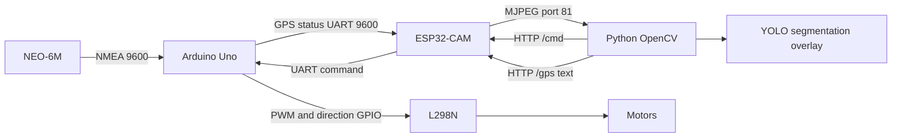

# Data flow

```mermaid
flowchart LR
 GPS[NEO-6M] -->|NMEA 9600| UNO[Arduino Uno]
 UNO -->|GPS status UART 9600| ESP[ESP32-CAM]
 ESP -->|MJPEG port 81| PY[Python OpenCV]
 PY --> YOLO[YOLO segmentation overlay]
 PY -->|HTTP /cmd| ESP
 ESP -->|UART command| UNO
 UNO -->|PWM and direction GPIO| L298N --> Motors
 PY -->|HTTP /gps text| ESP
```

The code displays GPS text but does not create a GPS-linked detection record.